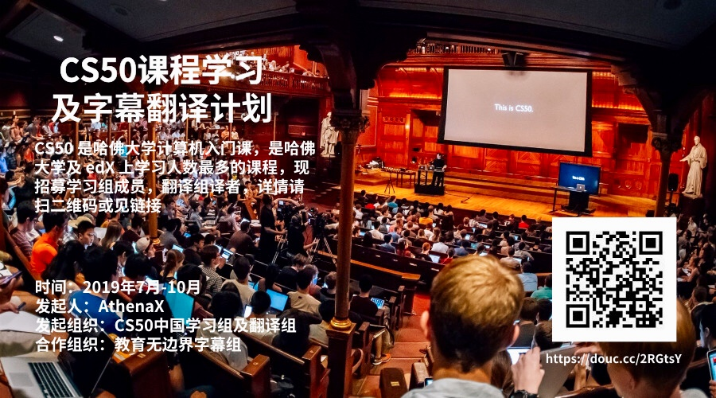

# CS50 课程学习与字幕翻译计划

[CS50 2019](https://courses.edx.org/courses/course-v1:HarvardX+CS50+X/course/) 是哈佛大学校内以及 MOOC 平台 [edX](edx.org) 上学习人数最多的计算机科学课程。本计划为教育公益项目，由计算机学习组者，MOOC 爱好者，及翻译爱好者联合组织管理，致力于创立维护高质量 CS50 学习者社区([学习组](#学习组))，并促进 CS50 课程在中文学习者中的传播([翻译组](#翻译组))。**永远欢迎新成员加入翻译组和学习组**，详情请见[CS50 课程学习与字幕翻译计划招新贴](hello_new.md)。

[CS50 2019](https://courses.edx.org/courses/course-v1:HarvardX+CS50+X/course/) is the largest course at Harvard University and on MOOC platform [edX](edx.org). CS50 Study Group and Subtitle Translation Initiative is a non-profit education initiative organized and managed by Computer Science learners, MOOC learners and translation amateurs. We aim to foster a high quality learning community and introduce free education resources to Chinese learners through different groups. **Study Group and Translation Group always welcome new members.** Please see [Recruitment Post](hello_new.md) for more information.  

## 课程简介

CS50 课程内容包括：C，数据结构与算法基础，Python (Flask)，前后端开发等等。课程结束后，学习者将能独立制作动态网站。[David J. Malan](https://en.wikipedia.org/wiki/David\_J.\_Malan) 教授本人讲课极富激情，教学深入浅出，对计算机零基础 (less comfortable) 非常友好，并且有一定基础的学生 (more comfortable)，也能学到足够多的知识。 CS50 课程视频由全职摄影团队制片，采用工业电影级摄影及制作设备，再现了[哈佛大学桑德斯剧场课堂现场](https://www.eventbrite.com/e/attend-a-cs50-lecture-in-person-tickets-70166767691)，力求给学习者带来最好的学习体验。 

## 注册选修

* 注册 [edX](https://edx.org) 并选修 [CS50x 2019](https://www.edx.org/course/cs50s-introduction-to-computer-science)
* 注册 [GitHub](https://github.com)，欢迎 watch、star 或者 fork [学习组 GitHub 项目](https://github.com/athena-xcy/CS50-Study-Group) 

说明: CS50 课程内容向全世界学习者免费开放。课程完成后，学习者可自愿选择购买 edX 官方认证的 CS50 结课证书。

## 学习组

### 分享讨论

活动当前共涉及两大主题：**CS50 学习经验交流**和**字幕翻译经验交流**

* CS50 学习
    * [CS50 入门指南](study-group/how_to_learn_CS50.md)
    * [Week 0 作业指北](study-group/week-0-walkthrough.md)
    * [Week 1 作业指北](study-group/week-1-walkthrough.md)
    * [Week 2 作业指北](study-group/week-2-walkthrough.md)
    * [Week 3 作业指北](study-group/week-3-walkthrough.md)（待整理）
    
* 字幕翻译
    * [字幕翻译原则](translation-group/principles-of-subtitle-translation.md)
    * [第一次招募试译分析](translation-group/translation-group-recruitment-0.md)
    * [L0 翻译经验分享](translation-group/translation-group-discussion-0.md)
    * [L0 校对反馈答疑](translation-group/translation-group-office-hour-0.md)
    * [L1 翻译经验分享](translation-group/translation-group-discussion-1.md)
    * [L2 翻译经验分享](translation-group/translation-group-discussion-2.md)
    * [第二次招募试译分析](translation-group/translation-group-recruitment-1.md)
   
### 时间安排

自 8 月 21 日开始第 0 轮 CS50 学习活动，目前进度为: ▓▓▓▓░░░░░░░░░░░ 30%

|        时间         |  课时  |                              官方笔记                              |                               作业                               |                         进度                         |
| :-----------------: | :----: | :----------------------------------------------------------------: | :--------------------------------------------------------------: | :--------------------------------------------------: |
| 08月21日 - 09月01日 | week 0 | [Notes](https://cs50.harvard.edu/college/2018/fall/weeks/0/notes/) | [Problem Set 0](https://docs.cs50.net/2019/x/psets/0/index.html) | [Week 0 作业指北](study-group/week-0-walkthrough.md) |
| 09月02日 - 09月08日 | week 1 | [Notes](https://cs50.harvard.edu/college/2018/fall/weeks/1/notes/) | [Problem Set 1](https://docs.cs50.net/2019/x/psets/1/index.html) | [Week 1 作业指北](study-group/week-1-walkthrough.md) |
| 09月09日 - 09月15日 | week 2 | [Notes](https://cs50.harvard.edu/college/2018/fall/weeks/2/notes/) | [Problem Set 2](https://docs.cs50.net/2019/x/psets/2/index.html) | [Week 2 作业指北](study-group/week-2-walkthrough.md) |
| 09月16日 - 09月22日 | week 3 | [Notes](https://cs50.harvard.edu/college/2018/fall/weeks/3/notes/) | [Problem Set 3](https://docs.cs50.net/2019/x/psets/3/index.html) | [Week 3 作业指北](study-group/week-3-walkthrough.md) |
| 09月23日 - 10月06日 | week 4 | [Notes](https://cs50.harvard.edu/college/2018/fall/weeks/4/notes/) | [Problem Set 4](https://docs.cs50.net/2019/x/psets/4/index.html) |                        进行中                        |
| 10月07日 - 10月14日 | week 5 | [Notes](https://cs50.harvard.edu/college/2018/fall/weeks/5/notes/) | [Problem Set 5](https://docs.cs50.net/2019/x/psets/5/index.html) |                         ...                          |
|        待定         |  ...   |                                ...                                 |                               ...                                |                         ...                          |

以上为学习组学习讨论活动时间表，鼓励学习者根据自己的情况自由调整

## 翻译组

### 翻译原则

* 【翻译原则零】信达雅：力求准确，适度意译，润色表达
* 【翻译原则一】严禁盲翻：只有结合场景剧情才能翻译的准确出彩
* 【翻译原则二】全文理解：开展翻译工作前，应看完对应视频、文件
* 【翻译原则三】简练准确：译文单句不宜过长，观众需要一眼就能看懂中文字幕
* 【翻译原则四】避免翻译腔：说人话，说中国话
* 【翻译原则五】灵活变通：根据需要调整语序
* 【翻译原则六】注意术语：查找资料搞懂专业术语含义
* 【翻译原则七】遵守格式：遵守字幕文件格式和翻译格式

要求细则请参见[字幕翻译原则](translation-group/principles-of-subtitle-translation.md)
 
### 翻译软件

* 本项目使用 Aegisub 辅助翻译工作，请参见[简明 Aegisub 教程](translation-group/Aegisub_Tutorial.md)

## 版权声明

 本作品采用<a rel="license" href="http://creativecommons.org/licenses/by-nc-sa/4.0/">知识共享署名-非商业性使用-相同方式共享 4.0 国际许可协议</a>进行许可。
