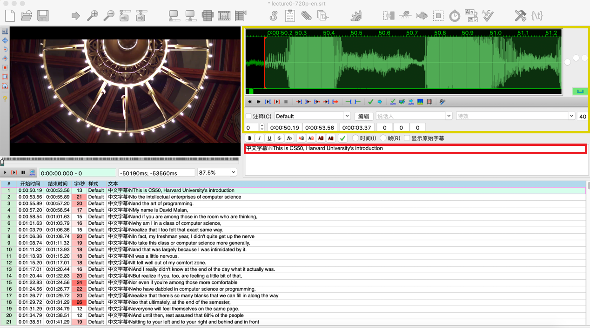

# 字幕翻译教程 v3.0

翻译计划：[CS50字幕译者计划招募帖](https://www.douban.com/group/topic/144969173/)

翻译讨论：[CS50学习组第0次分享讨论](study-group-discussion0.md)

最新更新：07/23/2019

## 翻译原则 

* 【翻译原则一】严禁盲翻：只有结合场景剧情才能翻译的准确出彩
* 【翻译原则二】全文理解：开展翻译工作前，应看完对应视频、文件
* 【翻译原则三】简练准确：译文单句不宜过长，观众需要一眼就能看懂中文字幕
* 【翻译原则四】避免翻译腔：说人话，说中国话
* 【翻译原则五】灵活变通：根据需要调整语序
* 【翻译原则六】注意专业术语：查找资料搞懂术语含义
* 【翻译原则七】遵守格式：遵守字幕文件格式和翻译格式

[细则请参见](principles-of-subtitle-translation.md)
 
## 翻译软件 Aegisub

[软件下载](http://www.aegisub.org/)  
[软件说明](http://docs.aegisub.org/3.2/Main_Page/)

### 文件格式

字幕文件格式为`.srt`文件。先确认字幕文件的编码是 Unicode，然后用 Aegisub 打开后，点击【文件】再【配置】按照设置。

`.srt`文件也可以用记事本, Notepad++, Sublime Text 等其他文本编辑器打开。

### 文本格式

第一行为字幕条序号，第二行为时间轴，第三行为中文翻译，第四行为英文翻译。

黄色方框的时间轴部分请勿改动。如有需要改动的断句，标注出来即可，后期校对会修改。红色方框中，把中文字幕四个字替换为中文翻译即可。

举例：
> 1  
> 00:00:50,190 --> 00:00:53,565  
> [中文字幕]  
> This is CS50  

### 文本导出

在 Aegisub 里选择【导出】再【存储】成 `.srt` 文件，文件命名格式：`Lecture[i]part[j]-[译者姓名].srt`。比如：`Lecture0part1-莉莉安.srt`。

### 翻译内容

* 字幕中若出现旁白/解释/说明的部分不用翻译，应直接删掉；如果此行只有这种说明性文字，则连带整个时间轴全部删掉。
    * 比如：[Applause]，完全可以删除。
    * 再比如：英文字幕中偶尔会有“David: xxxx”，这种情况下“David:”也可以删除。
* 对话类：不同两人的对白开头都要加英文半角的短横 “–” 引导，后一句和前一句对白内容之间为 2 个空格。
    * 比如：-你吃了吗  -我吃了。译为：-AAAAA  -BBBBB

### 常见问题 

* 问: 教授在课上讲软件界面上的按钮保留英文可以么？
    * 答：可以。
* 问：[Meow] 此处中文也要加方括号么？
    * 答：不用。
* 问：中文字幕和英文字幕是上下排版，还是左右排版？
    * 答1：用记事本的话，请手动换行，用 ae 的，在中文字幕后加上 `\N` 就行，不要空格。这个情况大概是合轴的时候软件把代码去掉了，麻烦手动换下行吧。
    * 答2：如果后期确实发现需要大量调整排版的话，我们可以用字符串处理程序去调整。
* 问：Mac 上可以在 ae 中先进行翻译操作，再保存修改，不需要导出。这样可以么？
    * 答：这是来自 Mac 的自动保存功能，这个做法容易造成数据丢失，不够安全，建议大家还是选择 ae 中的导出功能。
