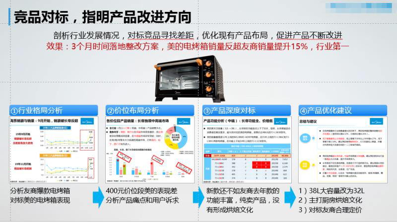

# 如何从数据中发现洞见

_by 黄灿星星_

通过本文能够了解以下内容：
1.了解数据分析是什么，能做什么，工作的流程。
2.能区分数据分析的思维与经验主义的差别，知道一些基本原则。
3.记录了一些关键的工具以及学习的网站。

## 数据分析是什么

我们生活在大数据时代，身边所有的一切都在往数字化转型发展，大家都讲究用数据说话，用数据衡量结果。从企业的招聘信息也可以窥探到些许趋势，对数据分析的要求由”有则优先“进化为”基本要求“。

大家有关注过招聘信息的，应该有留意到许多岗位都要求有这么一个技能要求了。很多同学都说自己数据分析能力强，但是他们时常遇到两个痛点

### 第一点，没有数据：

比如我们想分析用户对产品的口碑，但不知道如何获取数据，选择用问卷星做调查问卷。（很多大学生也是选择用问卷星收集数据，去写论文，这个数据质量大家都

那其实呢，我们是有工具可以搞定这些问题的，是爬虫技术，待会我会提到。

话说爬虫爬出来的数据会不会违法什么什么法律之类的……

莫慌，爬虫的原则是可见即所得。如果涉及到用户隐私数据的话，的确是违反法律，但是你通常技术没有那么高

### 第二点：拿到数据手忙脚乱，毫无分析思路

问题就在于，分析来分析去总是在原地打转，和理想中的”运筹帷幄，决胜千里“美好愿景相距甚远。主要是因为缺了数据分析思维。

我举个简单的例子，不知道在座有没有同学是这样的

稍懂数据可视化的，会将数据做成条形图、柱形图，不同维度对比数据，看看排名，再看看趋势

然后看完图表后就只是了解了现状，然后呢？你给我看这个做什么？说不出来

现在我一步一步讲清楚数据分析是什么，可以做什么，怎么开始做。以下是Agenda：
1.数据分析的定义
2.数据分析能做什么？
3.数据分析的工作流程
4.tbd

数据分析的定义：数据分析是通过数据发现问题的本质，甚至预测未来的趋势。与经验主义不同的是，我们是数据驱动。

## 第二：数据分析可以做什么？

发现规律，解释现象，验证假设，创造机会，讲好故事

发现规律：晚上8点做培训听众更多噢
解释现象：为什么产品新功能导致留存率提升20%？
验证假设：用户买我的空调是不是因为制冷速度快？
创造机会：如何进入小而美的市场，大赚单身狗的钱？
讲好故事：更优雅的说服老板、客户和同事，实在不行就睡服。

现在问题来了，数据是怎么一步步到最后的insight，然后再指导我们行动的？

这里我来放个经典的图

这个是DIKIW模型，从Data 到 Wisdom

刚才提到的许多人的痛点，画很多个图表，但是又讲不出所以然

Data:原始数据，或者是互联网上的文本信息
Information:比如销量高，一个产品月销量20000个，你大概知道它卖得好
Knowledge:各个information之间是有联系的，比如销量与销量环比这两个指标
Insight: 有价值的information，可以连接成故事的
Wisdom：下次遇到相同的data，你直接就知道结果

刚提到的DIKIW模型，最重要的是insight那一步，你结合业务发现有价值的information，而不是一位地把所有数据和图标展示

举个例子：

> 智能手环告诉我今天走了5235步（数据），我对比了近一年的步数折线图，发现自己步数越来越少了，体重也上升了（信息），综合考虑发现自己最近搬家到公司附近了，所以步行锻炼的时间缺少了，于是决定明天起，饭后额外抽出时间来散散步（洞察）

清楚这个模型之后，我们做数据分析还要有目标,数据分析的最终目标是“增长”

搞清楚你要增长的是什么？
增长利润？你想让产品卖得更好
增长用户数？互联网公司都希望自己用户数越多越好

增长用户活跃时长？对于edX来说，他们想增长用户上课的时间

增长效率？对比新的工作流程与现在的工作流程，发现新的工作流程可以更快完成

好，接下来直接进入独家秘诀

## 完整的数据分析框架思路

（PPT参见：[灿星-如何从数据中获得洞见.pdf](灿星-如何从数据中获得洞见.pdf)）

### 首先第一步，是观察表象：

要知道数据长什么样，才有切入点。

比如榨汁机的行业均价是200，某款榨汁机均价去到了400，比行业平均高得多。而榨汁机卖这么贵，有人要吗？这是个切入点

### 第二步：评估变化

为什么这些是变化的异常？

这个跟实际业务有关。比如我们的目标是每个月销量增长要达到10%，为此投入了很多人力。但是我们发现实际上我们的销量没有什么变化，每个月稳定在一定的量，这说明我们的投入都白费了，这里就是异常的。再者，理论上，对于edx来说每个星期网站的访问量平均是1000，但是最近几个星期突然平均访问量跌倒了500，这个就是下跌的异常。

### 第三部：多维分析

刚提到的投入投错了地方？这个问题通过多维分析是可以发现的。

如果不进行多维分析，会出现维度偏差这个情况。如下图

当时投广告的时候，要选目标群体。因为只看用户数，20~25这个群体是最高的，把钱投它身上很符合逻辑。

但是结果并不如意。于是进行多维分析发现，20~25这个群体的用户量的确最高，但是他们消费的客单价很低啊！！

而25~30，用户数没那么多仅有一般，但是他们消费的客单价高啊，一个相当于3个2-~25。

然后不进行多维分析，还会出现一个问题：幸存者偏差：比如微博和知乎人均月收入过万，都看起来文化程度很高，就会觉得我们国家现在文化程度很高。而实际上我们国家大专以上文凭的人群占比，在5%以下。

5%怎么算出来的呢？是内部数据。但是其实我们也可以推算出来，比如我们国家14亿人，今年高考人数900w，上年700w，可以去算一下，往高的算

### 第四步：寻找归因。

也就是相关性分析。

比如大家都知道身高跟体重是有一定的相关性的，如果一个人的身高220，那么他体重也应该是高于平常人，不然肯定异常瘦。

那再业务层面上，我们很多时候只是知道一个结果，比如销量跌了或者涨了，具体的原因是需要去研究的，相关性分析是其中一个方法。

举个例子

> 比如在某个图表里，你发现冰淇淋和太阳眼镜的销量都同时增加了，那结论是不是因为冰淇淋的销量上升，带动太阳眼镜的销量上升呢？
> 
> 很多人的分析思路是这样的，看到是正相关，就觉得有因果关系，实际上他们只是相关关系。
> 
> 因为都是在夏天，真正的因素是季节因素
> 
> 因为到了夏天，天气热了，冰淇淋跟雪糕的销量才会同时增长，而这两个产品之间是没太大因果关系。

### 第五步：预测分析：

严谨讲，我们都说相关性不说因果。除非证据确凿。

大家听过的回归分析，时间序列，本质上都是预测分析，我一句话带过：
根据已有的信息找到规律，公式，去预测未来

最后我来讲几个我公司的案例

通过竞品对标，指明产品的改进方向

1.观察表象 + 评估变化：看行业格局发现，竞品爆款电烤箱逐渐拉开我们的距离。
2.多维分析&寻找归因&联合分析：价位段维度与产品痛点维度。发现我们是在某个价位段表现差，然后有几个指标差评率比较高。最重要的是我们没有形成烘焙文化。
3.趋势预测：（我们看到32L的产品销量环比越来越高）把38L改成32L，同时主打厨房烘焙文化，对标友商合理定价。

成功在3个月内实现反超，销量提升15%

> 「提问：寻找差距的过程中，怎么排除消费者定位的影响，以及，如何确认消费者要什么？」
> 
> 这个问题，在电商领域的话是通过分析用户评论来解决

电商的每一条评论都是用户主动发出来的，而且是真实的心声。

每一条评论我们都会把它算到某个指标上，我举个例子：

美的洗衣机排水堵塞住了，差评。

这里讲到的是洗衣机的排水问题，指标是这样的：
一级指标：产品体验
二级指标：排水
三级指标：堵塞

对每一条网站上的评论都进行了观点提取与情感分析后，我们大概能分析出他们想要什么。

这时候可以了解消费者的满意度

> 之前看到有公司爬同类产品的真实评论刷好评 这种脏数据咋辨别啊？
> 
> 脏数据的话要看是不是同一时间大量爆发
> 
> 如果每天刷一点，那这个真的没办法

分享的最后，大家可以试着用下我上面提到的数据分析7个武器，应用到实际的分析上去噢。

## 补充2个原则

### 原则1：

不要把数据作为起点，而应该是问题。
做数据分析的确要先有数据，但是有数据不意味可以进行数据分析

例子：为客人做一顿美味佳肴，需要了解有无忌口，偏好，地狱差异等情况，像医生一样望闻问切。不然，无论你对什么客人都用你认为的美味佳肴麻辣香锅来招待，对于我这个不能吃辣的广东人来说是欲哭无泪。

### 原则2：数据不是全部，还要关注商业环境。

要有灵性，不要生搬硬套模型。

之前发生过一个情况，某一类产品从结果看销量比较好。我们分析共性，模仿着做了一款产品，但是卖得很差。后面发现原因是地域与一些政策等没办法数据量化的原因影响了结果。

这也是数据分析有难度的地方，商业环境太复杂。不同公司产品形态不一样，政策不一样都会有影响。

没有一个通用的模型可以一刀切，但是通用的思维框架就有
