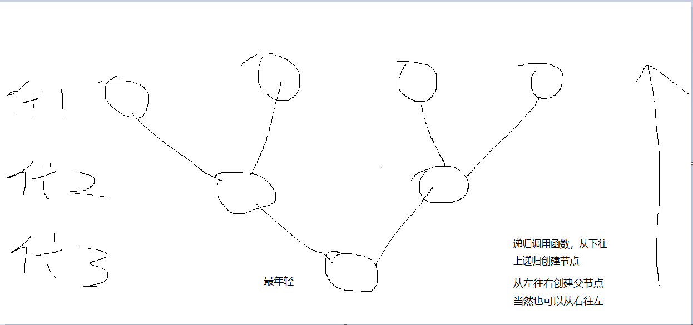
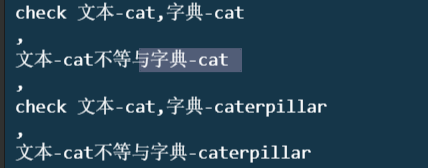

#Week5 Walkthrough  ==(2021.cs50)==

*Zhangxh251 供稿 2021.12.3* 


# Lab_week5_inheritance

# inheritance-==(迭代调用)==

没整明白 这迭代调用

### 背景

> The `create_family` function takes an integer (`generations`) as input and should allocate (as via `malloc`) one `person` for each member of the family of that number of generations, returning a pointer to the `person` in the youngest generation.

实现一个血缘表。（具体请看cs50的Lab题目说明）


### ==create_family()思路==

实际上就是去implement一个二叉树（把下图倒过来看看，嘻嘻）



下图，是我对于我写的create_family() 函数中 递归调用实现二叉树的一个理解。

1. 最外的框框(第三代)---第一次调用， return 1个节点(即，最年轻的第3代)

2. 蓝色框框(第二代)------在第一次调用中的  递归调用， return 1个节点(即，第3代的 父亲/母亲 节点)

3. 略


```c
Newp->parents[0] = create_family(generations-1);
Newp->parents[1] = create_family(generations-1);
// TODO: Randomly assign child alleles based on parents
Newp->alleles[0] =  Newp->parents[0]->alleles[rand()%2];
Newp->alleles[1] =  Newp->parents[1]->alleles[rand()%2];
```

这样递归 就形成了 二叉树，  本程序先初始化 左节点 再初始化右节点。**（先完成第二代的左节点，再完成第二代的右节点，最后初始化第二代（第3代的父亲节点）；  然后再以相同顺序完成 第3代的母亲节点）**

### Code

```c


// Create a new individual with `generations`
person *create_family(int generations)
{
    // TODO: Allocate memory for new person
     person *Newp = malloc(sizeof(person));
    // Generation with parent data
    if (generations > 1)
    {
        // TODO: Recursively create blood type histories for parents
        Newp->parents[0] = create_family(generations-1);
        Newp->parents[1] = create_family(generations-1);
        // TODO: Randomly assign child alleles based on parents
        Newp->alleles[0] =  Newp->parents[0]->alleles[rand()%2];
        Newp->alleles[1] =  Newp->parents[1]->alleles[rand()%2];
    }

    // Generation without parent data
    else
    {
        // TODO: Set parent pointers to NULL
        Newp->parents[0] = Newp->parents[1] = NULL;
        // TODO: Randomly assign alleles
        Newp->alleles[0] = random_allele();
        Newp->alleles[1] = random_allele();
        printf("第 %d 代的基因- %c%c\n",generations, Newp->alleles[0], Newp->alleles[1]);
    }

    // TODO: Return newly created person
    return Newp;
}

// Free `p` and all ancestors of `p`.
void free_family(person *p)
{
    // TODO: Handle base case
    if(p == NULL)
    {
        printf("p = NULL");
        return;
    }
    // TODO: Free parents
    if(p->parents[0] !=NULL)
    {
        free_family(p->parents[0]);
    }
    else if(p->parents[1] !=NULL)
    {
        free_family(p->parents[1]);
    }
    // TODO: Free child
    free(p);
    p = NULL;
}

// Print each family member and their alleles.
void print_family(person *p, int generation)
{
    // Handle base case
    if (p == NULL)
    {
        return;
    }

    // Print indentation
    for (int i = 0; i < generation * INDENT_LENGTH; i++)
    {
        printf(" ");
    }

    // Print person
    printf("Generation %i, blood type %c%c\n", generation, p->alleles[0], p->alleles[1]);
    print_family(p->parents[0], generation + 1);
    print_family(p->parents[1], generation + 1);
}

```


#---------分割线----------

这部分已经有前辈 在week4中总结， 可能由于cs50 19 与cs50 2021 课程设置有关， 所以我下面的笔记没有再整理了。 （我看得懂，读者可能 一头雾水， 有疑问可以在群内提问，也可发送邮件到zxhwangyi163@163.com，但是我很菜）

# Problem Set

# speller 

实现一个拼写检查器， （使用哈希表）

## 背景

check 

1. 严格区分大小写
2. foo在字典  foo‘ s 也不算错误拼写

dictionary

1. 都是小写

2. (even, for simplicity, proper nouns and acronyms). From top to bottom, the file is sorted lexicographically, with only one word per line (each of which ends with `\n`). 字典文件 每行一个单词，行尾以\n结尾
3. 


Your spell checker must not leak any memory. Be sure to check for leaks with `valgrind`.

## getrusage（）与struct rusage

[进程资源信息 struct rusage - 剑不飞 - 博客园 (cnblogs.com)](https://www.cnblogs.com/nealgavin/p/3797472.html)

>利用getrusage可以得到进程的相关资源信息。如：用户开销时间，系统开销时间，接收的信号量等等;
>
>
>
>如果参数RUSAGE_SELF，则得到的是当前进程的资源信息。如果是RUSAGE_CHILDREN，则将返回当进程的终止掉的子进程和等待子进程的资源信息。当调用成功后，返回0，否则-1；
>下面是一个例子：
>
>istruct rusage usage;
>igetrusage(RUSAGE_SELF, &usage);

[(28 封私信 / 81 条消息) 为什么C语言中函数（time, getrusage）要这样设计？ - 知乎 (zhihu.com)](https://www.zhihu.com/question/429798410/answer/1570074521)


## ferror()

```c
int ferror(FILE *stream)
```

检查文本操作中是否有错c误，有错返回非零


## ==Makefire==

暂时不懂


## strcpy（）

```c
char *strcpy(char *dest, const char *src)
```

> ## 参数
>
> - **dest** -- 指向用于存储复制内容的目标数组。
> - **src** -- 要复制的字符串。
>
> ## 返回值
>
> 该函数返回一个指向最终的目标字符串 dest 的指针。


##在单链表尾部插入节点

1. 创建新节点，并赋值，==该节点的 next记得=NULL==

### ==陷阱？ 我出现过的问题==

2. ==RNM！！！，只能说有坑？== 

   ```c
   //在链表尾部插入节点
              node *temp =table[index];
              while(temp != NULL)
              {
                  temp = temp->next;
             }
             temp->next = n;
   //！！！！！！！！！！！！！！！！！！！！！！！
   //这tm是错的艹尼玛，这样弄出来 没有对链表进行操作，操作的是temp
   //而且这样 会出现段错误，temp 会访问到没有申请到的空间
   
   //我的思考 ，tm雀氏操作的是指针
   
   //又没完全错？？？？？？？？？？？？？
     //在链表尾部插入节点
               node *temp =table[index];
               if(temp == NULL)
               {
                   //temp = n;  //这样写，第一个节点插不进
                   table[index] = n;           
               }
               else
               {
                   while(temp->next != NULL)
                   {
                       temp = temp->next;
                   }
                   temp->next = n;
                   
               }
   ```

   也可以优化  分为空链表 和 非空链表

   1. 空链表  就不用 temp 了  直接 head -> next 指向新节点
   2. 非空  遍历链表知道 链尾。 

##strcasecmp()

To compare two strings case-insensitively, you may find [`strcasecmp`](https://man.cs50.io/3/strcasecmp) (declared in `strings.h`)useful!

This function returns

- an `int` less than `0` if `s1` comes before `s2`, ignoring case,
- `0` if `s1` is the same as `s2`, ignoring case, or
- an `int` greater than `0` if `s1` comes after `s2`, ignoring case.


## 大小写转换

tolower（）  toupper（）

## debug 随笔

用malloc（） 别忘记 include <stdlib.h>


*利用printf（）来debug*


2021/12/2: 

1. **问题：**把字典插入 表 有问题，  新节点赋值成功， 但是没插到链表里来

2. size（） ok

3. **问题：**check   不ok  dictionary 和 word 传入的参数没问题都是 cat  cat， 但是strcasecmp() 出来却不等

   可能一个 最后带了\n？一个没带？   

   ```c
       while(temp != NULL)
       {
           //如果 两字符串/单词相等
           printf("check 文本-%s,字典-%s,\n",word,temp->word); //test
           if(strcasecmp(word, temp->word) == 0)
           {
               printf("文本-%s=字典-%s,\n",word,temp->word);//test
               return true;
           }
           else
           {
                printf("文本-%s不等与字典-%s,\n",word,temp->word);//test
               temp = temp->next;
           }
       }
   ```

   运行结果：

   

   表明： 字典传入的单词复制进了一个 转义字符？    文本传入的单词却没有， 导致字符串比较出错


```
   while(fread(&c, sizeof(char), 1, file_dictionary))
    {
        //读到一个/n 算该单词结束

        word[index] = c;
        index++;

        if(c == '\n')
        {
            index = 0;
            //把该单词放入hash,失败，会返回false
            if( !TableInsert(word) )
            {
                printf("Could not insert!\n");
                return false;
            }
        }

    }
```

